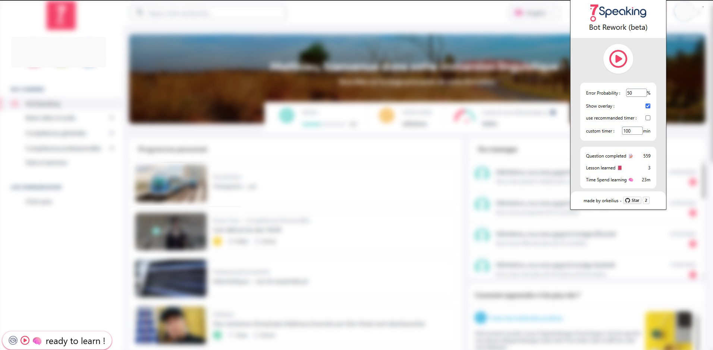

# 7speaking bot rework

a browser extension to automate learning on 7speaking.com

inspired by [7speaking bot legacy](https://github.com/Dixel1/7speaking-bot-legacy)

## Features
- Automatically quiz completion (On lesson)
- Automatically open and waiting on lesson pages
- overlay
- stat



## Install
### Firefox
1. Download the .xpi file from the [releases](https://github.com/orkeilius/7speaking-bot-rework/releases/)
2. Open file with firefox

### Opera / Vivaldi / Yandex
1. download the .crx file from the [releases](https://github.com/orkeilius/7speaking-bot-rework/releases/)
2. Go to `chrome://extensions/` and enable developer mode
3. Drag and drop the .crx file into the extensions page

### Chrome / Edge / Brave ( 🚨 no automatic update 🚨)
1. download the .zip file from the [releases](https://github.com/orkeilius/7speaking-bot-rework/releases/)
2. Unzip the file
3. Go to `chrome://extensions/` and enable developer mode
4. Click on "Load unpacked" and select the unzipped folder

## Getting Started

```bash
yarn install

yarn run dev
```
