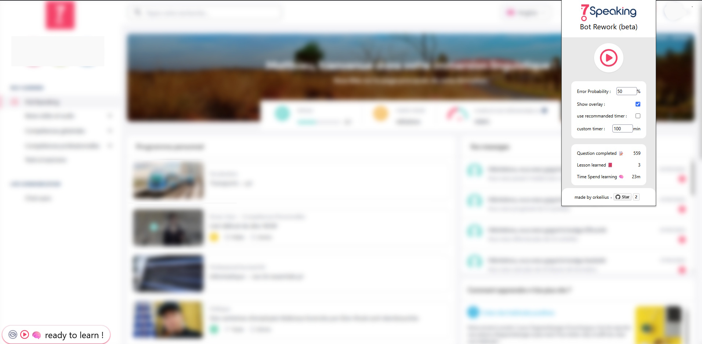

# 7speaking (+ prepMyFuture) bot rework

A browser extension to automate learning on 7speaking.com and prepmyfuture.com

inspired by [7speaking bot legacy](https://github.com/Dixel1/7speaking-bot-legacy)


[](https://wakatime.com/badge/user/b3086389-10af-4dfc-a8ea-5893ce3fda92/project/87a3c834-38de-4c73-875c-a22dd7ef45cd)
[](https://sonarcloud.io/summary/new_code?id=orkeilius_7speaking-bot-rework)
[](https://sonarcloud.io/summary/new_code?id=orkeilius_7speaking-bot-rework)
[](https://sonarcloud.io/summary/new_code?id=orkeilius_7speaking-bot-rework)
[](https://sonarcloud.io/summary/new_code?id=orkeilius_7speaking-bot-rework)


## Features
- work on 7speaking and PrepMyFutur
- Automatically quiz completion (On lesson)
- Automatically open and waiting on lesson pages
- overlay
- stat



## Install
### Firefox
1. Download the .xpi file from the [releases](https://github.com/orkeilius/7speaking-bot-rework/releases/)
2. Open file with firefox

### Opera / Vivaldi / Yandex
1. download the .crx file from the [releases](https://github.com/orkeilius/7speaking-bot-rework/releases/)
2. Go to `chrome://extensions/` and enable developer mode
3. Drag and drop the .crx file into the extensions page

### Chrome / Edge / Brave ( 🚨 no automatic update 🚨)
1. download the .zip file from the [releases](https://github.com/orkeilius/7speaking-bot-rework/releases/)
2. Unzip the file
3. Go to `chrome://extensions/` and enable developer mode
4. Click on "Load unpacked" and select the unzipped folder

## developement
### Getting Started

```bash
yarn install

yarn run dev
```

### github secret

Those secret are needed to run the ci and publish a new extension

#### ci / e2e
| name | description |
| --- | --- |
| SONAR_TOKEN | token for sonar scan |
| WEBSITE_TEST_USERNAME | 7speaking user login |
| WEBSITE_TEST_PASSWORD | 7speaking user password |

#### cd
| name | description |
| --- | --- |
| CRX_KEY | pgp key to sign the extension on chrome(ium) |
| FIREFOX_API_KEY | extension workshop api key |
| FIREFOX_API_SECRET | extension workshop api secret | 
| DEPLOY_KEY | key to push on main (for version bump) |